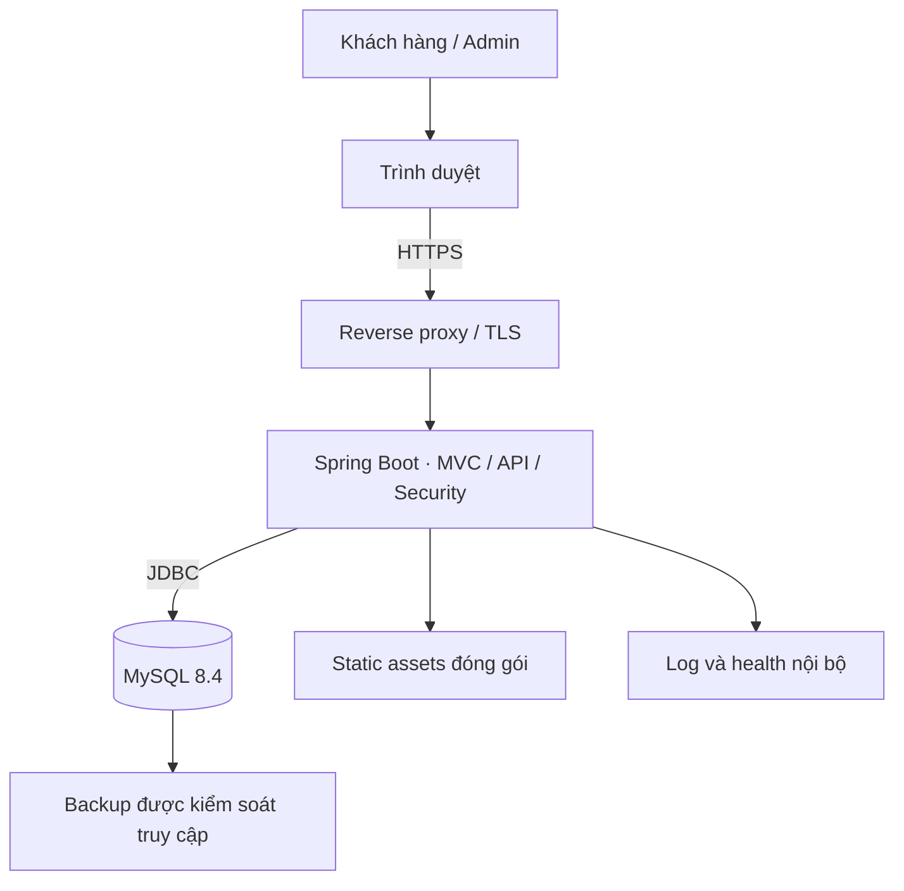
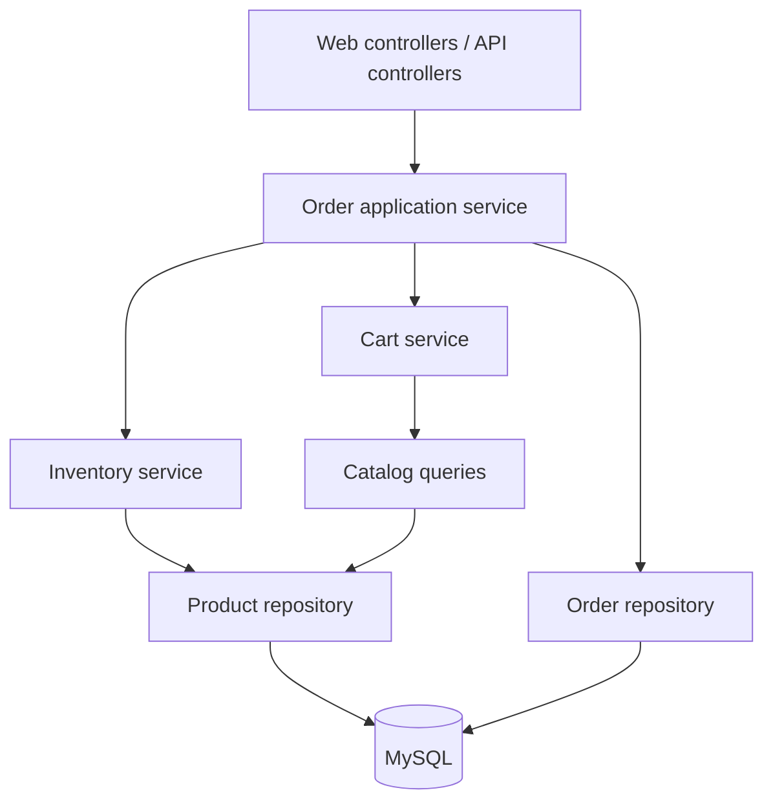

# Kiến trúc hệ thống

## 1. Hướng thiết kế

Chọn **modular monolith**: một ứng dụng Spring Boot, một MySQL, giao diện server-rendered Thymeleaf cùng origin. Lợi ích cho phạm vi một người: transaction order/kho đơn giản, một artifact deploy, học rõ MVC/JPA/security. Đổi lại module cần giữ boundary bằng cấu trúc package và review; chưa cần microservices.

Java 21 và Spring Boot 4.1.1 là baseline tài liệu. Khi bootstrap, pin phiên bản ổn định cụ thể và dùng dependency management của Boot. Bootstrap 5 được đóng gói thành static asset; không cần CDN để demo chạy độc lập. Không có framework frontend thứ hai trong MVP.

## 2. Container và deployment

Local có thể chạy app từ IDE và MySQL bằng Docker; staging/demo chạy app container cùng MySQL có persistent volume. Production thật cần quyết định hosting, backup ngoài máy, quy trình giao thất bại, lưu dữ liệu và các yêu cầu vận hành bổ sung. Tài liệu này không triển khai dịch vụ hay thay đổi quyền GitHub.

## 3. Module, trách nhiệm và dependency

| Module | Trách nhiệm | Được phụ thuộc |
|---|---|---|
| identity | User, register, password encoder, authenticated principal | shared |
| catalog | Category, Product, ảnh asset, search/read/edit | shared |
| inventory | Stock adjustment, ORDER/CANCEL movements, locking stock | catalog, identity (actor id), shared |
| cart | Cart/items/version, pricing preview | catalog, identity, shared |
| order | Checkout/cancel/transition, snapshots, history | cart, catalog, inventory, identity, shared |
| reporting | Read-only projection và KPI | order, catalog, shared |
| shared | Error, Clock, money, pagination, request id | Không phụ thuộc module nghiệp vụ |
| config | Security, MVC, persistence, environment | identity và shared |

Admin là quyền và presentation route, không phải một domain thứ hai có database logic riêng. Admin controllers nằm trong module catalog/inventory/order/reporting. Tránh cart gọi OrderService tạo vòng lặp; order orchestration gọi CartService. Không expose JPA entity qua JSON; DTO/projection là hợp đồng.

## 4. Cấu trúc project dự kiến

| Đường dẫn sau bootstrap | Nội dung |
|---|---|
| src/main/java/vn/techshop/TechShopApplication.java | Entry point |
| src/main/java/vn/techshop/config/ | Security/config |
| src/main/java/vn/techshop/shared/ | Error, Clock, money, paging |
| src/main/java/vn/techshop/identity/ | web, api, application, domain, persistence |
| src/main/java/vn/techshop/catalog/ | Tương tự, có admin controller |
| src/main/java/vn/techshop/inventory/ | Stock operations và ledger |
| src/main/java/vn/techshop/cart/ | Cart/version/preview |
| src/main/java/vn/techshop/order/ | Checkout/state machine/snapshots |
| src/main/java/vn/techshop/reporting/ | Read-only query và DTO |
| src/main/resources/templates/ | layouts, auth, catalog, cart, order, admin |
| src/main/resources/static/ | css, js, assets/products |
| src/main/resources/db/migration/ | Flyway migration đã kiểm chứng |
| src/test/ | Unit, MVC/security, MySQL integration tests |
| docs/, database/ | Tài liệu và SQL tham chiếu hiện có |

Đường dẫn src/, pom.xml và wrapper chưa tồn tại ở baseline tài liệu. Không tạo các lớp rỗng chỉ để khớp sơ đồ; bootstrap bằng lát cắt dọc chạy được.

## 5. Transaction, khóa và cạnh tranh

CheckoutService là entry point public gọi qua Spring proxy với @Transactional. InventoryService tham gia transaction hiện có, không dùng REQUIRES_NEW cho thay đổi tồn của order. Runtime failure rollback cả order/cart/ledger. Đối với exception kiểm tra, khai báo rollbackFor phù hợp; không catch rồi trả success.

| Operation | Lock và thứ tự | Hành vi |
|---|---|---|
| Cart mutation | cart row | Check version, sửa items, tăng version |
| Checkout | cart row → product rows id tăng dần | Check key cũ trước cartVersion; lấy stock/price mới, ghi tất cả, clear cart |
| Cancel | order row → product rows id tăng dần | Check owner/state/version, hoàn tồn một lần |
| Transition | order row | Check state/version, update/history; DELIVERED có codCollected |
| Stock adjust | product row | Check expectedVersion, delta, stock ≥0; ledger |
| Product metadata edit | Optimistic @Version | Không set stock từ DTO; version đổi sau cập nhật |

Cart và order row dùng PESSIMISTIC_WRITE cho quyết định mutation; product checkout dùng lock write và query mới để không đọc persistence context stale. Với JPA, @Version trên cart/product/order/category để ngăn lost update và expose expectedVersion. Tất cả writer stock đi qua cùng InventoryService. Lock timeout/deadlock trả 409 RETRYABLE_CONFLICT, không tự retry mù sau mutation. Chỉ retry checkout với cùng key/payload; preview lại khi bị PRICE_CHANGED/CART_CHANGED.

Khi transition/cancel, flush cập nhật order trong transaction để @Version tăng rồi lấy version mới ghi history; commit vẫn bao phủ cả update và history. Không tự set version của entity để bắt chước cơ chế JPA. Tương tự response cart/product trả version sau flush; test phải kiểm tra version thực trong database.

Đảm bảo unique(user_id, checkout_key), unique(cart_id, product_id), unique product SKU/email ở DB. Các constraint là lớp bảo vệ cuối. Ledger ORDER/CANCEL có unique(order_item_id, movement_type), order history một transition/version. Transaction lock sử dụng MySQL thật để kiểm thử; H2 không là bằng chứng cho behavior InnoDB.

## 6. Bảo mật

- Form login do Spring Security xử lý, session-based; không xây JWT trong v0.1. Đổi session id sau login. Cookie HttpOnly, SameSite=Lax; Secure khi HTTPS.
- Giữ CSRF; form dùng token Thymeleaf, AJAX cùng origin lấy token từ GET /api/v1/csrf và gửi X-CSRF-TOKEN. Login/logout cũng phải có token.
- Public GET chỉ catalog active. Route /admin/** và /api/v1/admin/** yêu cầu ADMIN. /cart, /checkout, /orders và API tương ứng yêu cầu CUSTOMER.
- Ownership trong application service và query, không chỉ ẩn nút UI. Request id không thuộc khách trả 404.
- PasswordEncoder với BCrypt, kiểm tra byte-length; không log password/OTP/session. Rate limit login ở proxy hoặc application: baseline 10 thất bại/15 phút theo tổ hợp IP + normalized username, 429; không dùng khóa tài khoản vô thời hạn.
- Render description/note bằng text escaping, không th:utext cho input. Repository query bind parameters, sort allowlist. Không fetch URL ảnh tùy ý để tránh SSRF.
- Actuator chỉ health tối thiểu công khai nếu hosting yêu cầu; chi tiết health/metrics nội bộ. DB không mở public, credentials từ environment.

Policy rate limit có thể ảnh hưởng mạng chung; tuần 2 phải kiểm thử và ghi cấu hình có thể thay đổi. Mục tiêu bảo mật cụ thể nằm ở NFR-01, không suy ra là audit an ninh hoàn chỉnh.

## 7. Read model và hiệu năng

Catalog dùng DTO projection, pagination và index. Detail tải ảnh có kiểm soát; tránh N+1 ở order listing: page order rồi batch items khi cần, không fetch-join collection trong query phân trang. Reporting dùng aggregate read-only, không load toàn bộ order vào Java. Không cache trước khi đo; nếu dùng cache sau, phải định nghĩa invalidation giá/tồn.

Giới hạn size=50, order items tối đa 20, query báo cáo tối đa 366 ngày. Giữ transaction ngắn, không gửi email/call shipping trong lock. Kiểm tra EXPLAIN với dữ liệu đủ lớn trước tối ưu index.

## 8. Giới hạn kiến trúc và bước mở rộng

Một instance app giữ session là đủ demo. Khi scale nhiều instance cần session store hoặc sticky session và kiểm thử lại CSRF/auth. Upload ảnh cần object storage và pipeline kiểm tra tệp. Payment online cần bảng payment và webhook an toàn; không gắn trực tiếp vào transition order hiện tại. Khi nhiều SKU/kho, stock chuyển thành bảng inventory riêng, báo cáo và locking thay tương ứng.

Xem [ADR và nguồn](11-decisions-and-sources.md) để biết lý do lựa chọn và những quyết định còn mở.
