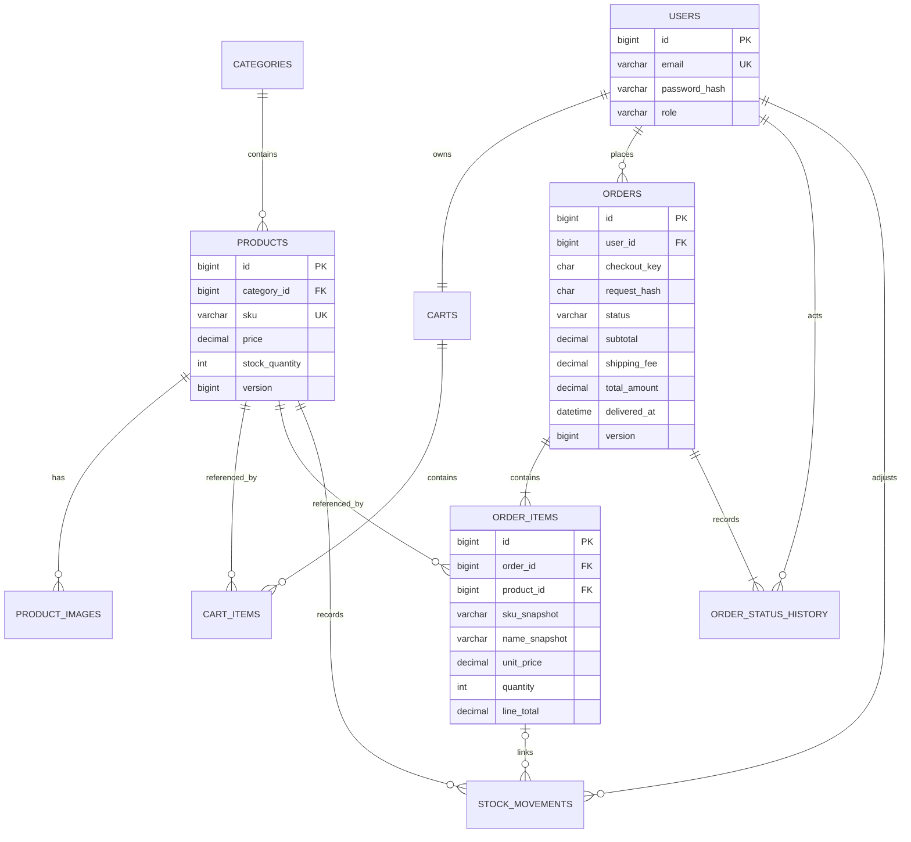

# Thiết kế dữ liệu · MySQL 8.4

DDL tham chiếu đầy đủ tại [schema.sql](../database/schema.sql). Bản SQL là thiết kế chưa chạy trên MySQL trong lượt lập tài liệu. Cần thực hiện B-03/TC-26 để kiểm chứng và chuyển thành Flyway migration trước khi coi là schema ứng dụng.

## 1. ERD

Database FK không tự đảm bảo mỗi order có ít nhất một item/history hoặc mỗi user có cart. Application transaction + test bảo đảm cardinality tối thiểu. ERD là mô hình nghiệp vụ, không phải mọi cardinality đều có thể biểu diễn bằng FK.

## 2. Quy ước

- PK BIGINT AUTO_INCREMENT; API id là số nguyên dương. Không dùng mã đơn để thay ownership.
- Mã hiển thị TS-{id padded tối thiểu 8 số}, sinh từ id; không giả định tổng ID có đúng tám chữ số.
- VARCHAR status/role + CHECK thay vì MySQL ENUM để migration dễ theo dõi. JPA EnumType.STRING.
- Money DECIMAL(15,0) và Java BigDecimal; currency cố định VND. Input price ≤999.999.999; tổng tối đa theo giới hạn giỏ nhỏ hơn capacity cột.
- DATETIME(6) lưu UTC, connection/session timezone UTC. Display và analytics chuyển sang Asia/Ho_Chi_Minh. Không dùng DEFAULT CURRENT_TIMESTAMP nếu chưa kiểm soát timezone.
- version BIGINT ánh xạ @Version; bắt đầu 0. expectedVersion là token cạnh tranh, không phải quyền truy cập.
- Email normalized lowercase; checkout_key canonical UUID lowercase, request_hash SHA-256 hex. SKU/code uppercase.
- Không xóa cứng users/products/orders trong luồng MVP. Cart items được xóa khi đặt thành công hoặc khách xóa khỏi giỏ.

## 3. Data dictionary

Các bảng có created_at/updated_at khi cần; danh sách dưới ghi cả thuộc tính nghiệp vụ và thuộc tính kiểm soát quan trọng. Nullable được nêu rõ; các cột không được nêu nullable là NOT NULL.

| Bảng | Field chính | Ý nghĩa và ràng buộc |
|---|---|---|
| users | id, full_name(100), email(254), password_hash(255), role(16), created_at | Email unique; role CUSTOMER/ADMIN; hash có encoder prefix nếu dùng DelegatingPasswordEncoder |
| categories | id, code(50), name(100), status(16), version, created_at, updated_at | Code unique; ACTIVE/INACTIVE; ngừng category làm ẩn hàng public |
| products | id, category_id, sku(50), name(200), description TEXT nullable, price DECIMAL, stock_quantity INT, status(16), version, timestamps | SKU unique bất biến; stock ≥0, giá ≥0, FK category; stock chỉ qua inventory |
| product_images | id, product_id, asset_path(255), alt_text(200), sort_order INT | Local asset allowlist; sort ≥0; ảnh đầu theo sort_order/id là thumbnail |
| carts | id, user_id, version, created_at, updated_at | Unique user_id; một cart/user; cart được giữ sau checkout |
| cart_items | id, cart_id, product_id, quantity INT, timestamps | Unique cart/product; quantity 1–99; không lưu giá thanh toán |
| orders | id, user_id, checkout_key CHAR(36), request_hash CHAR(64), status, recipient_name(100), phone(10), address(500), note(500) nullable, currency CHAR(3), subtotal, shipping_fee, total_amount, cod_collected BOOLEAN, delivered_at nullable, version, timestamps | Unique user/key; VND; total=subtotal+fee; DELIVERED iff có delivered_at và cod_collected=true |
| order_items | id, order_id, product_id, sku_snapshot(50), name_snapshot(200), unit_price, quantity, line_total | Unique order/product; immutable; line_total=unit_price×quantity; snapshot không cập nhật theo product |
| order_status_history | id, order_id, actor_user_id, from_status nullable, to_status, reason(500) nullable, order_version, occurred_at | unique order/version; initial null→PENDING version0; history append-only |
| stock_movements | id, product_id, actor_user_id, order_item_id nullable, movement_type, delta INT, balance_after INT, reason(500), occurred_at | ADJUSTMENT/ORDER/CANCEL; ORDER âm, CANCEL dương; adjustment không có order_item; unique order_item/type cho hoàn tồn một lần |

Giới hạn 20 dòng/cart, độ dài minimum nghiệp vụ, role actor, transition, sum(items)=subtotal và số lượng stock movement so với order item phải được application kiểm tra; không thể hiện hết bằng CHECK. Asset allowlist cũng là application rule.

## 4. Index và kiểu truy vấn

| Index | Truy vấn phục vụ | Lưu ý |
|---|---|---|
| products(status, category_id, price, id) | Lọc category active + giá + page | Đo EXPLAIN; sort newest cần lựa chọn khác khi dữ liệu lớn |
| orders(user_id, created_at, id) | Lịch sử đơn của khách | Page order trước, items fetch riêng |
| orders(status, created_at, id) | Admin lọc đơn theo trạng thái | Không scan toàn bộ entity |
| orders(status, delivered_at, id) | Báo cáo giao thành công theo thời gian | Dùng range UTC, không bọc delivered_at bằng DATE trong WHERE |
| order_items(product_id, order_id) | Top sản phẩm và truy vết order | Aggregate bằng snapshot và product_id |
| stock_movements(product_id, occurred_at, id) | Ledger sản phẩm | Có thể đối chiếu SUM(delta) với stock |
| order_status_history(order_id, occurred_at, id) | Timeline | Unique(order_id, order_version) thêm kiểm soát |

LIKE '%keyword%' không được giải quyết tốt bằng B-tree name. V0.1 chấp nhận với mục tiêu 1.000 sản phẩm; nếu đo không đạt, xem FULLTEXT và kiểm tra ngôn ngữ/tìm không dấu trước khi đổi yêu cầu. Không tuyên bố index này đã tối ưu nếu chưa đo.

## 5. Snapshot, ledger và source of truth

Product.stock_quantity là balance thao tác; stock_movements là audit. Product tạo stock=0; mọi thay đổi ban đầu/đơn/hủy/điều chỉnh đều có movement, nên SUM(delta) phải bằng balance. Không sửa/xóa movement để khớp báo cáo; dùng adjustment có lý do khi đối soát cần sửa.

Order snapshots là source of truth cho tiền/địa chỉ lịch sử; catalog hiện tại chỉ dùng để tham chiếu product. Revenue đọc orders/order_items đã DELIVERED, không lấy giá hiện tại. Order status history không tính lại doanh thu; delivered_at là mốc ghi nhận.

## 6. Thời gian và chất lượng dữ liệu

Chọn range ngày Việt Nam [ngày đầu 00:00, ngày sau ngày cuối 00:00), chuyển sang UTC trong Java bằng ZoneId. Dùng tham số startUtc/endUtc cho SQL. Ví dụ ngày 01/10/2026 là [2026-09-30 17:00:00 UTC, 2026-10-01 17:00:00 UTC).

Các kiểm tra: subtotal = sum line_total; total = subtotal+fee; DELIVERED đủ timestamp/COD; CANCELLED không có delivered_at; mỗi ORDER movement đúng -quantity; mỗi CANCEL đúng +quantity; actor là account tồn tại; email/sku không trùng; không stock âm.

## 7. Lưu giữ và quyền dữ liệu

Demo chỉ dùng dữ liệu giả lập. Địa chỉ và điện thoại trong order là dữ liệu riêng, chỉ chủ đơn/admin được đọc; không log và không đưa vào export public. Backup phải kiểm soát quyền. V0.1 chưa chốt chính sách giữ/xóa dữ liệu cho cửa hàng thật; phải xác nhận với chủ dự án trước production. Đóng tài khoản/xóa dữ liệu cá nhân là phase riêng với chính sách xử lý snapshot, không cascade xóa đơn tùy tiện.
