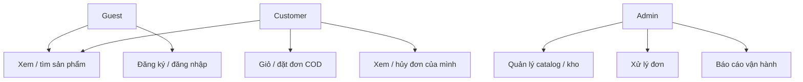
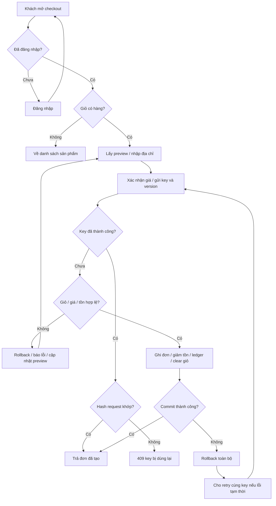
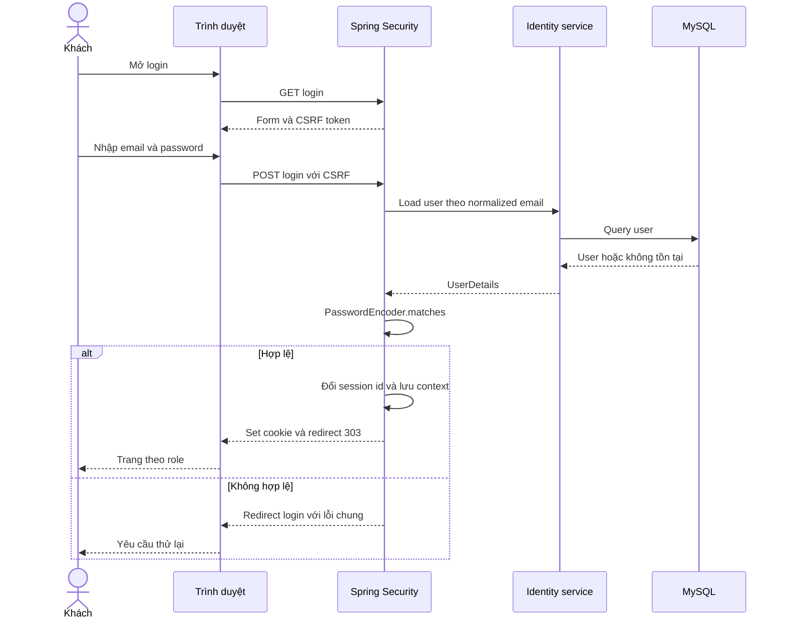
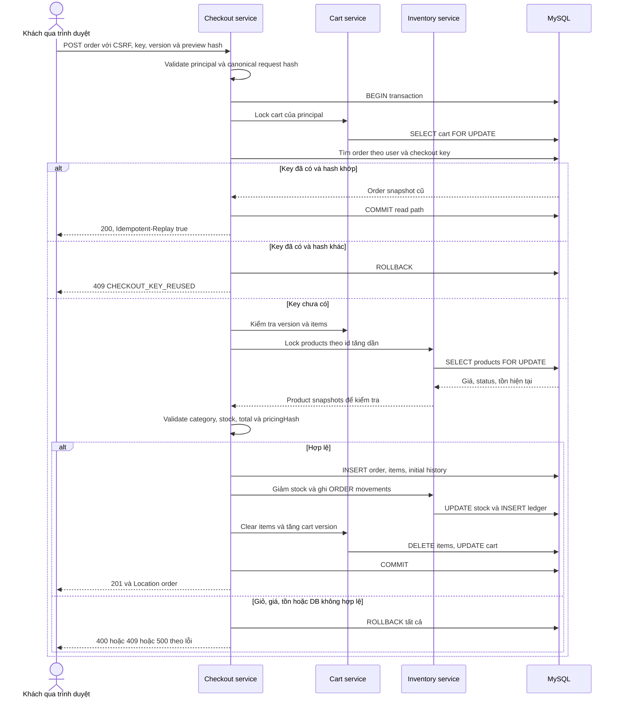
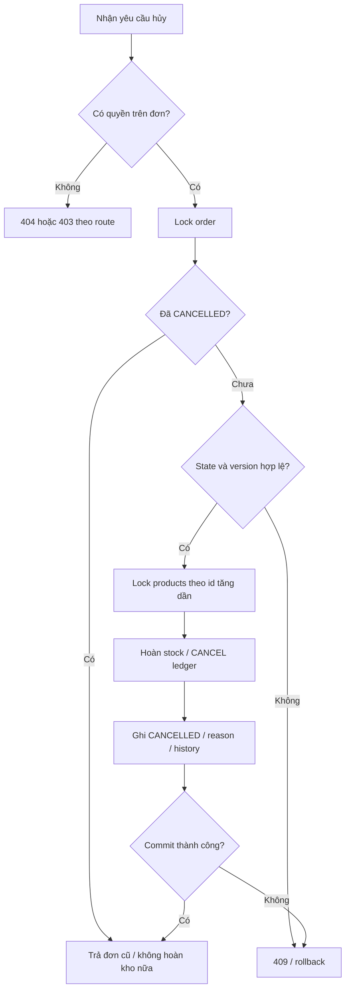
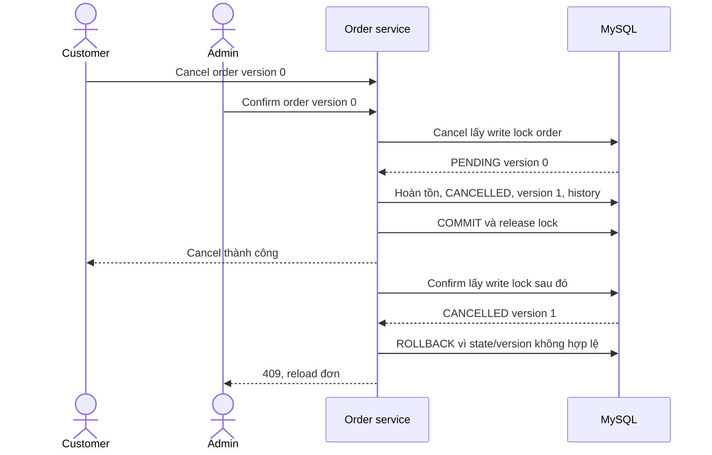
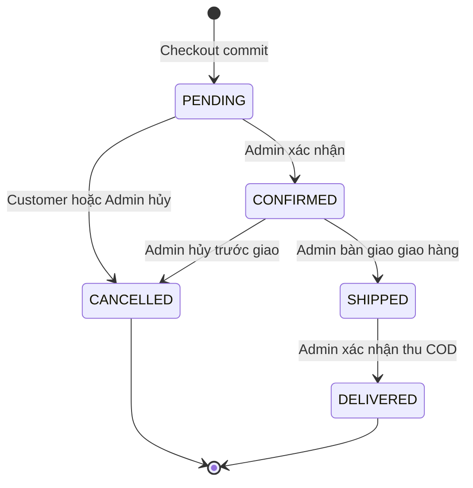
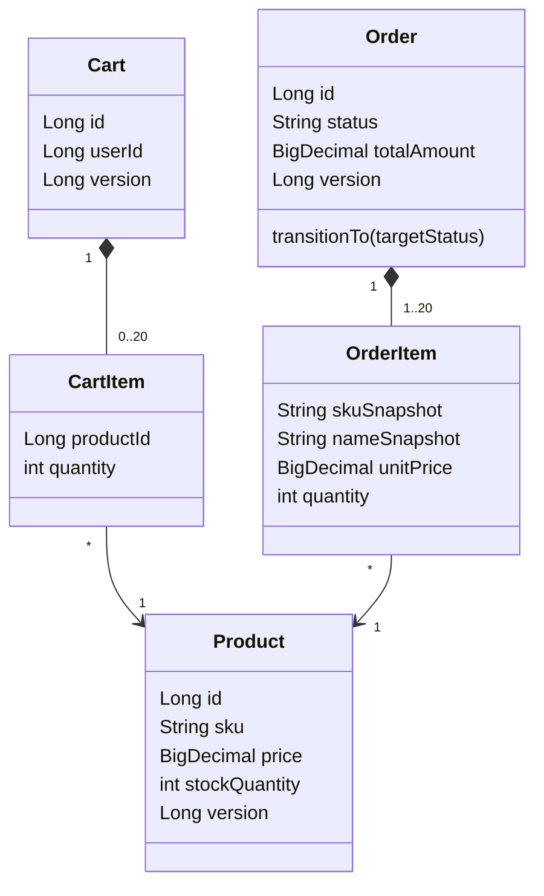
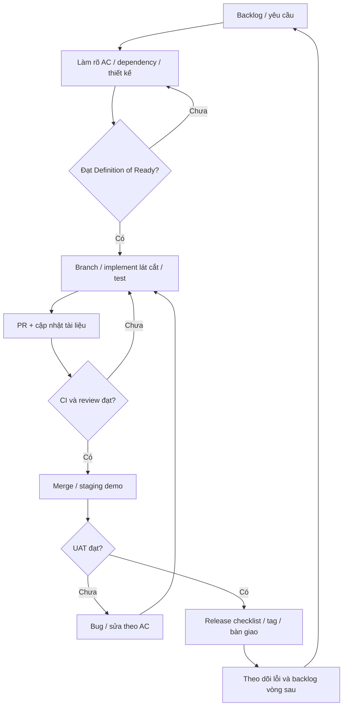
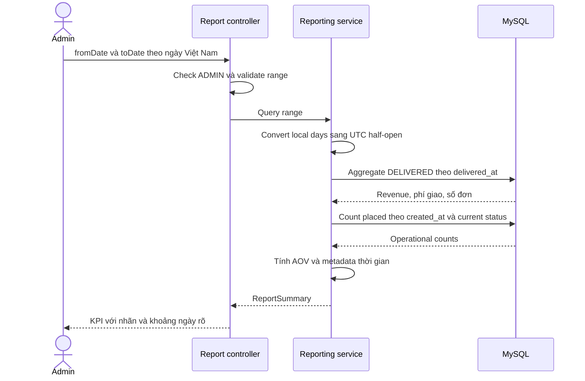

# Sơ đồ nghiệp vụ và hệ thống

Mermaid là nguồn sơ đồ, render trực tiếp trên GitHub. Đây là mô hình thiết kế dự kiến. ERD ở [data design](03-data-design.md); container/module ở [architecture](02-architecture.md). Actor ADMIN là người thao tác, không phải tác vụ tự động.

## D-01 · Phạm vi use case theo actor

Mermaid không có UML use-case native trong bộ này; sơ đồ dưới là bản đồ actor/chức năng, không trình bày như UML use-case chuẩn.

## D-02 · Activity đặt hàng

Validate quyền, body và CSRF trước nhánh idempotency. Retry cùng key chỉ dùng khi payload không thay đổi. Giá/giỏ thay đổi phải preview và xác nhận lại với key mới; không tự đặt theo giá mới.

## D-03 · Sequence đăng nhập

Không log password/token; rate limit chặn trước khi xử lý quá nhiều lần đăng nhập. Response redirect thực tế cần cấu hình success/failure handler trong bootstrap security.

## D-04 · Sequence checkout và idempotency

Các thông điệp gọi service ở đây cùng một transaction do CheckoutService mở. API không lưu userId từ request. Nếu mất response sau commit, gửi lại cùng key/hash.

## D-05 · Activity hủy đơn

## D-06 · Sequence cạnh tranh confirm/cancel

Nếu confirm lấy lock trước, đơn thành CONFIRMED/version1; customer cancel version0 thua và không hoàn tồn. Admin vẫn có thể cancel CONFIRMED bằng yêu cầu mới sau reload. Sơ đồ là một interleaving, test phải kiểm tra cả hai thứ tự.

## D-07 · State machine đơn COD

| Transition | Điều kiện | Tác động tồn/tiền |
|---|---|---|
| Tạo → PENDING | Checkout hợp lệ | Giảm tồn; chưa ghi doanh thu |
| PENDING → CONFIRMED | Admin + version hiện tại | Không thay tồn |
| CONFIRMED → SHIPPED | Admin + version hiện tại | Không thay tồn |
| SHIPPED → DELIVERED | Admin + codCollected=true | Ghi delivered_at; đủ điều kiện báo cáo thu COD |
| PENDING → CANCELLED | Owner hoặc admin + lý do | Hoàn tồn đúng một lần |
| CONFIRMED → CANCELLED | Admin + lý do | Hoàn tồn đúng một lần |

Không có transition SHIPPED → CANCELLED. Hàng giao thất bại/đổi trả phải bổ sung thiết kế riêng, không dùng chỉnh stock để che sai trạng thái đơn.

## D-08 · Class diagram miền nghiệp vụ cốt lõi

Class diagram là domain sketch, không quy định getter/setter hay cascade JPA. Checkout/cancel là application orchestration; entity không gọi repository hoặc HTTP.

## D-09 · Quy trình phát triển và quality gate

## D-10 · Sequence truy vấn báo cáo

