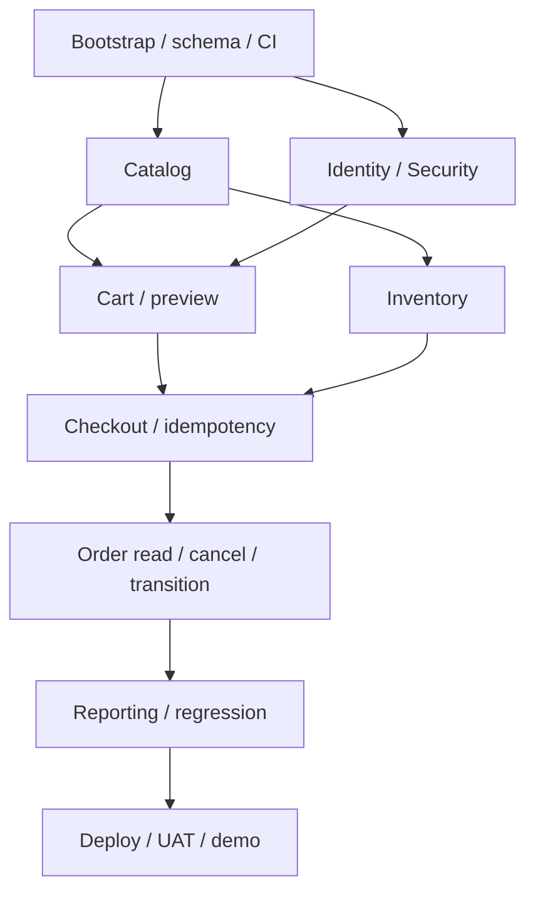

# Kế hoạch phát triển và quy trình delivery

## 1. Năng lực, ước lượng và phạm vi

Baseline: 1 developer đã có Java/SQL cơ bản, 6 ngày/tuần × 3 giờ/ngày × 6 tuần = **108 giờ**. Backlog Must tổng **90 giờ**, dự phòng **18 giờ** cho học/tích hợp/lỗi. Giờ là ước lượng ban đầu, không có dữ liệu velocity; đây là kế hoạch tương đối căng. Nếu chưa học Spring/JPA/Security, dùng 8–10 tuần hoặc giảm tính năng; sau tuần 1 phải cập nhật bằng actuals.

Không tính việc đã lập bộ tài liệu này vào 90 giờ code; B-01 là review/chốt baseline. Giờ test core phân bổ cả trong feature và B-20 dành cho cross-module regression. Không bắt đầu phase 2 khi Must hoặc quality gate chưa xong.

## 2. Roadmap sáu tuần

| Tuần | Backlog chính | Giờ kế hoạch | Dự phòng | Milestone / demo |
|---|---|---:|---:|---|
| 1 | B-01/02/03/04/05 | 15 | 3 | M1: cold start, Flyway, trang catalog và CI xanh |
| 2 | B-06/07/08/09 | 15 | 3 | M2: login/role, admin quản lý category/product |
| 3 | B-10/11/12 + 2h B-13 | 14 | 4 | M3: inventory ledger, cart version, preview; checkout đang triển khai |
| 4 | 5h B-13 + B-14/15/16 | 16 | 2 | M4: checkout/idempotency, đơn cá nhân/cancel chạy xuyên suốt |
| 5 | B-17/18/19 + 5h B-20 | 15 | 3 | M5: admin transition/report, regression trọng yếu |
| 6 | 3h B-20 + B-21/22/23/24 | 15 | 3 | M6: regression cuối, đo hiệu năng, staging, UAT, release/demo |

Tổng giờ task: 90; tổng dự phòng: 18. B-13 trải tuần 3–4, B-20 trải tuần 5–6. Mỗi tuần có capacity 18 giờ. Không bắt đầu B-21/B-22 trước khi critical regression của B-20 đạt; cập nhật lịch theo actuals, không cắt quality gate để giữ mốc.

## 3. Chu kỳ làm việc

Mỗi tuần là một sprint nhỏ. Ngày 1: chọn mục tiêu và task Ready; ngày 2–5: implement/test/demo nội bộ; ngày 6: demo milestone, kiểm tra AC, cập nhật estimate/risk và chuẩn bị tuần sau. Ngày nghỉ không tính capacity.

Daily 5 phút ghi: đã xong gì, bước tiếp theo, blocker, actual hours. Dùng GitHub Projects/Issues nếu được tạo sau; baseline này mới là backlog tài liệu, chưa tự tạo issue hay thêm người vào repo.

## 4. Dependency và critical path



Critical path là schema → inventory/cart/identity → checkout → cancel/transition → regression/UAT. Responsive polishing không được trì hoãn kiểm thử transaction. Báo cáo bắt đầu khi status/timestamps đã cố định.

## 5. Definition of Ready

Một task Ready khi có: FR/BR liên quan, AC kiểm chứng được, quyền/validation và lỗi đã rõ, dependency có thể dùng, tác động schema/API xác định, estimate vừa một lát cắt 2–8 giờ. Task lớn tách thành phần nhưng giữ một mục tiêu business xuyên suốt.

## 6. Definition of Done

- Đạt AC và luồng lỗi liên quan; code chạy cùng MySQL thật khi feature chạm DB.
- Không bỏ qua ownership/CSRF/transaction để demo.
- Test phù hợp có kết quả pass; các test critical của feature chạy CI.
- DTO/entity không lộ field nhạy cảm; migration chạy fresh database.
- README/spec/schema/API cập nhật nếu behavior thay đổi; reviewer hiểu trigger và kết quả.
- Không TODO nghiêm trọng làm sai tiền/tồn/quyền; commit/PR nhỏ, có bằng chứng demo.

Một task được code nhưng chưa kiểm thử/tài liệu chưa đạt Done. Coverage tỷ lệ không thay thế test cạnh tranh và rollback.

## 7. Git workflow

Main là branch tích hợp. Feature branch đặt feature/B-13-checkout, fix/B-16-cancel-race hoặc docs/spec-update. Ưu tiên PR nhỏ; squash merge sau CI/review. Khi một người làm, vẫn tự review diff, dùng checklist và không merge khi test fail. Branch protection là đề xuất vận hành, chưa được bật bằng lượt viết tài liệu.

Ví dụ lệnh trên máy đã clone và có SSH hợp lệ:

```bash
git switch main
git pull --ff-only origin main
git switch -c feature/B-13-checkout
git add src docs
git commit -m "feat(order): create COD orders with stock transaction"
git push -u origin feature/B-13-checkout
```

Đọc [CONTRIBUTING](../CONTRIBUTING.md) trước khi thực hiện; không force-push main. Trong môi trường không truy cập SSH, dùng connector GitHub được cấp quyền; không coi việc cấu hình origin là đã push thành công.

## 8. Change request

Mỗi thay đổi ghi CR-ID, nhu cầu/benefit, FR/BR/data/API/test ảnh hưởng, effort, risk, đề xuất Must/phase2, quyết định PO và phiên bản tài liệu. Ví dụ CR-001 guest checkout ảnh hưởng identity/cart/order, cần quyết định về xác minh và ownership; không thêm âm thầm.

Thay đổi business rule phải cập nhật SRS, API, schema nếu cần, diagram, test và analytics trước merge. Với bug chỉ khôi phục spec hiện tại, không mở CR nhưng vẫn ghi issue/test hồi quy.

## 9. Mốc nghiệm thu và release

M1–M3 là mốc kỹ thuật; M4 kiểm tra happy path và cạnh tranh checkout/cancel; M5 đối soát báo cáo; M6 cold start từ máy khác, UAT, staging, backup restore và README/video.

Release dự kiến v0.1.0-mvp sau khi đủ quality gate, không tạo tag ứng dụng từ bộ tài liệu. Release note nêu chức năng, tests, giới hạn (COD thủ công, giao thất bại/đổi trả chưa hỗ trợ), thay đổi schema và hướng dẫn rollback.

## 10. Kế hoạch sau MVP

| Phase | Nội dung | Điều kiện mở |
|---|---|---|
| 1.1 | Upload ảnh, email/reset password, địa chỉ có cấu trúc | MVP ổn, có dịch vụ lưu trữ/email và test abuse |
| 1.2 | Giao thất bại/hàng trả về, hoàn kho qua tiếp nhận vật lý | Spec vận hành thật được PO xác nhận |
| 1.3 | Payment online | Provider chọn, payment ledger/webhook/threat model rõ |
| 2 | Biến thể/nhiều kho/scale session | Có nhu cầu thật và số liệu chứng minh |
