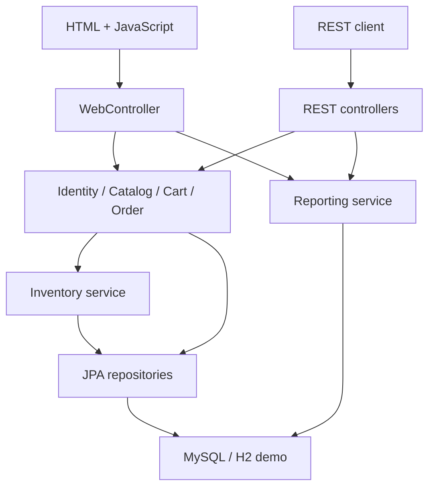

# Trạng thái triển khai — bản code đầu tiên

Ngày: 01/10/2026 theo Asia/Ho_Chi_Minh. Branch: `feature/techshop-first-implementation`. Các tài liệu 00–11 là yêu cầu/thiết kế mục tiêu; tài liệu này ghi nhận những gì đã có trong mã nguồn. Chưa phát hành hay gắn tag MVP.

## Phần đã triển khai

| Backlog | Code hiện tại | Giới hạn |
|---|---|---|
| B-02–04 | Java 21, Boot 4.1.1, Maven Wrapper, Flyway, 10 entity, Docker/Compose, CI H2 + MySQL | Chưa triển khai staging, chưa có docs-validation job |
| B-05 | Catalog/detail active, search tên, lọc danh mục/giá, sort, phân trang | Ảnh SVG dùng chung |
| B-06–07 | Register CUSTOMER, BCrypt, session login/logout, bootstrap admin, CSRF, role/owner guard, lỗi API, request ID | Login limiter trong RAM từng instance; chưa có distributed limiter |
| B-08 | Admin tạo/sửa danh mục, unique code, trạng thái, optimistic version | List danh mục hiện chưa phân trang |
| B-09 | Admin tạo/sửa sản phẩm, SKU bất biến, giá VND, version, trạng thái | Chưa có quản lý ảnh riêng; entity/table product_images được chuẩn bị |
| B-10 | Nhập/điều chỉnh kho, lock product, ledger, từ chối tồn âm | Trang chỉnh sửa hiển thị 20 biến động gần nhất; API ledger có phân trang |
| B-11–12 | Cart lock/version, tối đa 20 dòng, qty 1–99, gộp SKU, cập nhật/xóa, preview hash/phí | Cart chưa batch-load toàn bộ product/category; cần đo query trước tối ưu |
| B-13–14 | COD checkout transaction, snapshot, giảm kho/ledger, clear cart, unique key/hash/replay | Chưa có auto-retry deadlock; trả conflict để client gửi lại cùng request |
| B-15–17 | Đơn owner-scoped, timeline, cancel/hoàn tồn một lần, transition/version, thu COD | List đơn hiện chỉ lọc trạng thái; chưa có date/keyword filters |
| B-18 | Dashboard, delivered revenue, phí giao, AOV API, top products, giờ Việt Nam→UTC | Chưa có conversion/cancel-rate UI, CSV/export hay tracking event |
| B-19 | Giao diện responsive, labels, thông báo lỗi, empty states, giá thay đổi cần xác nhận lại | Chưa audit accessibility đầy đủ |
| B-20 | Regression tests cho các luồng dưới đây | Chưa phủ hết 34 scenario của test plan |
| B-21–24 | README chạy thật và bản demo local | Chưa load test, backup/restore drill, staging, UAT sign-off, video/tag release |

## Kiểm chứng

- `mvn verify`: **14 tests, 0 failures, 0 errors**, Java 21, H2 2.4.240. Test profile dùng Flyway H2 riêng, Hibernate validate schema.
- 3 unit tests: biên phí giao hàng, pricing hash khi tổng tiền bằng nhau nhưng giá đổi, state transitions.
- 11 integration tests chạy transaction thật, MockMvc/Security và executor nhiều thread; không dùng transaction rollback tự động bao quanh mỗi test.
- Các tình huống: checkout/replay/snapshot/cancel/ledger; price-change và key-reuse; CSRF/role/owner/unknown-field; render trang khách/admin; stale cart/tồn âm; transition/COD/doanh thu theo delivered_at; tranh một đơn vị tồn; cùng key checkout đồng thời và cancel đồng thời; rollback toàn bộ đơn/items/history/ledger/cart; session login/logout; inactive category và input/filter validation.
- Rollback test cố ý ném lỗi trước commit của transaction ngoài đang chứa checkout, rồi xác nhận không có write nào tồn tại. Chưa có fault injection cho lỗi JDBC giữa từng bước service.
- Browser smoke test dùng ứng dụng demo thật: đang ghi nhận kết quả sau khi chạy. Không coi MockMvc là bằng chứng JavaScript thao tác thành công.
- MySQL 8.4.9 đã initialize trong môi trường phát triển, nhưng server bị môi trường chặn mở UNIX socket; lần test MySQL local không kết nối được. Vì vậy kết quả H2 không được coi là bằng chứng MySQL concurrency. Workflow `mysql-tests` dùng MySQL 8.4 service trên GitHub Actions; xem kết quả của commit/PR trước merge.
- Dockerfile/Compose có trong repo, nhưng chưa chạy Docker build/Compose tại môi trường phát triển này do không có Docker daemon. Không có bằng chứng deployment/restore/performance và chưa công bố p95/coverage.

Integration tests chỉ chấp nhận H2 memory `techshop-test` hoặc database MySQL tên **techshop_test** trước khi dọn dữ liệu; có guard chống trỏ nhầm database. CI dùng một database rỗng riêng.

## Kiến trúc code đang chạy

Spring Security chạy trước controller; không lấy userId/role từ request body. Entities dùng scalar foreign-key IDs, quan hệ được DB constraints bảo vệ; DTO là Java records, không expose passwordHash/entities. Version của entity mới để `null` để Spring Data nhận biết persist; Hibernate gán version khi insert. JPA open-in-view tắt.

Checkout khóa Cart trước, kiểm tra replay, rồi khóa Product theo thứ tự ID tăng. Order/items/snapshot/stock/history/cart nằm trong cùng transaction. Cancel khóa Order rồi Product theo thứ tự ID tăng, trạng thái CANCELLED là đường replay không hoàn tồn thêm. Tồn kho và lịch sử đơn có unique constraints hỗ trợ chống ghi trùng.

Đồng bộ với baseline không có nghĩa toàn bộ API contract đã implement. Các controller/record trong `src/main/java` là hợp đồng thực thi hiện tại.

## Chênh lệch hợp đồng và quyết định cho lát cắt này

| Baseline | Bản triển khai hiện tại | Việc cần làm |
|---|---|---|
| Bootstrap 5 | CSS responsive đóng gói riêng, không CDN | ADR-12; quyết định thống nhất UI framework trước mở rộng |
| Testcontainers | H2 nhanh + MySQL service trong CI, env để test DB local | ADR-13; có thể thêm Testcontainers khi môi trường hỗ trợ Docker |
| Product images / thumbnail | thumbnailPath trả `/assets/products/device.svg`; chưa có images CRUD | Bổ sung packaged asset allowlist và primary-image rule |
| Category API phân trang | Public/admin trả list CategoryView | Đồng bộ contract hoặc implement pagination trước API release |
| Admin order date/keyword | Chỉ status/page/size | Implement filters theo contract |
| Checkout output summary | Trả OrderView đầy đủ, 201+Location; replay 200+Idempotent-Replay | Ghi OpenAPI và kiểm thử contract trước publish API |
| Order/line fields theo tài liệu mục tiêu | `total`, `items`, `unitPrice`, `lineTotal`; code đơn `TS-` + ID padding | Chuẩn hóa tên/format và cập nhật contract phiên bản thực thi |
| Analytics đầy đủ | Summary delivered revenue/AOV, placed, status snapshot, top | Conversion events và KPI còn lại ở giai đoạn sau |
| Quan sát/vận hành | request ID, lỗi không expose stacktrace, cookie/session settings | Chưa Actuator health/metrics, central logging hoặc alert |

Phí giao 30.000 ₫ dưới subtotal 1.000.000 ₫, miễn phí từ ngưỡng này; tính bằng BigDecimal nguyên VND. Pricing hash chứa product ID/quantity/unit price/currency/shipping fee; request hash checkout còn chứa version/tổng kỳ vọng/địa chỉ. Tiền hàng/fee/report tính từ snapshot đơn; thời gian DATETIME(6) được lưu và đọc UTC. Báo cáo date range theo Việt Nam dùng khoảng UTC nửa mở, tối đa 366 ngày.

## API hiện có

| Nhóm | Route chính |
|---|---|
| Auth | GET /api/v1/csrf; POST /api/v1/auth/register; GET /api/v1/me; POST /login; POST /logout |
| Catalog | GET /api/v1/categories; GET /api/v1/products; GET /api/v1/products/{id} |
| Cart | GET /api/v1/cart; POST /api/v1/cart/items; PATCH/DELETE /api/v1/cart/items/{id} |
| Orders khách | POST/GET /api/v1/orders; GET /{id}; POST /{id}/cancel |
| Admin catalog | GET/POST /api/v1/admin/categories và /products; PATCH /categories/{id} và /products/{id}; GET /products/{id} |
| Inventory | POST /api/v1/admin/products/{id}/stock-adjustments; GET /stock-movements cùng prefix product |
| Admin orders | GET /api/v1/admin/orders và /orders/{id}; POST /orders/{id}/transitions và /orders/{id}/cancel |
| Reports | GET /api/v1/admin/reports/summary và /reports/top-products |

Mutation API dùng JSON và `X-CSRF-TOKEN` lấy từ GET /api/v1/csrf cùng cookie/session; DELETE cart truyền `expectedVersion` trong query. Browser login/logout gửi form với hidden `_csrf`. Không có endpoint công khai tạo ADMIN.

## Bước tiếp theo để nghiệm thu MVP

1. CI MySQL xanh: migration/validate, khóa nhiều connection, replay/cancel/rollback/report; bổ sung đảo thứ tự giỏ nhiều sản phẩm và các race chưa phủ.
2. Hoàn thiện quản lý ảnh, admin filters, hợp đồng API/OpenAPI và các AC còn lại; đối chiếu 34 case của test plan, không đánh dấu đạt hàng loạt theo số test.
3. Đo truy vấn/p95 với dataset có quy mô, tối ưu cart batch query theo số đo; kiểm tra accessibility/mobile thêm.
4. Docker/staging HTTPS, health/metrics, secrets, backup/restore và rollback drill.
5. UAT theo spec, lưu evidence, demo video, release notes rồi mới tag MVP.
